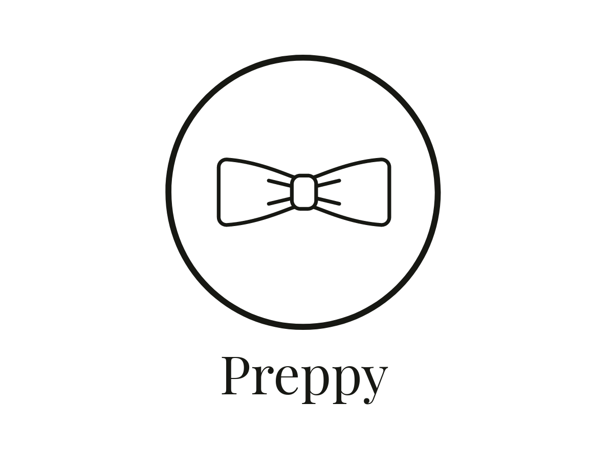

<div align="center">
  
</div>

A small Python package for preparing *ordered* language data for RNN language models.


## Usage

```python
from preppy.latest import Prep

train_documents = ['Hello World', 'Hello again']

prep = Prep(train_documents,
            reverse=False  # generate batches starting from last document
            num_types=2,   # vocabulary size
            slide_size=2,   # number of words skipped when sliding batch across corpus
            batch_size=1,   # batch size 
            context_size=1, # number of back-prop-through-time steps
            num_evaluations=2)  # number of times evaluation of learning will take place during training
            
for batch in prep.gen_windows():
   pass  # train model on batch
```

## Compatibility

Developed on Ubuntu 16.04 and Python 3.6
